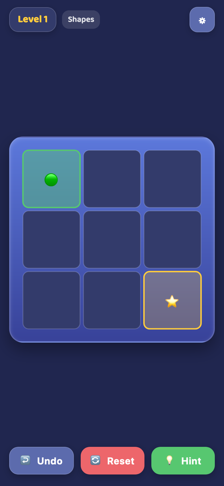
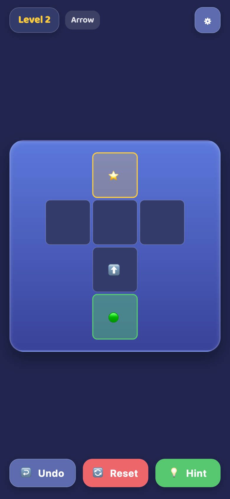
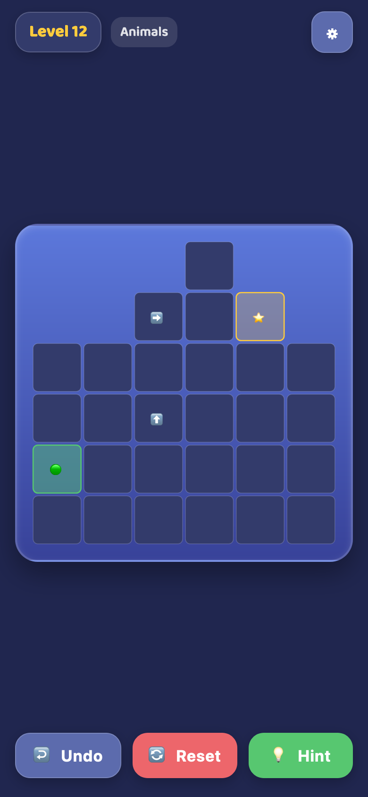
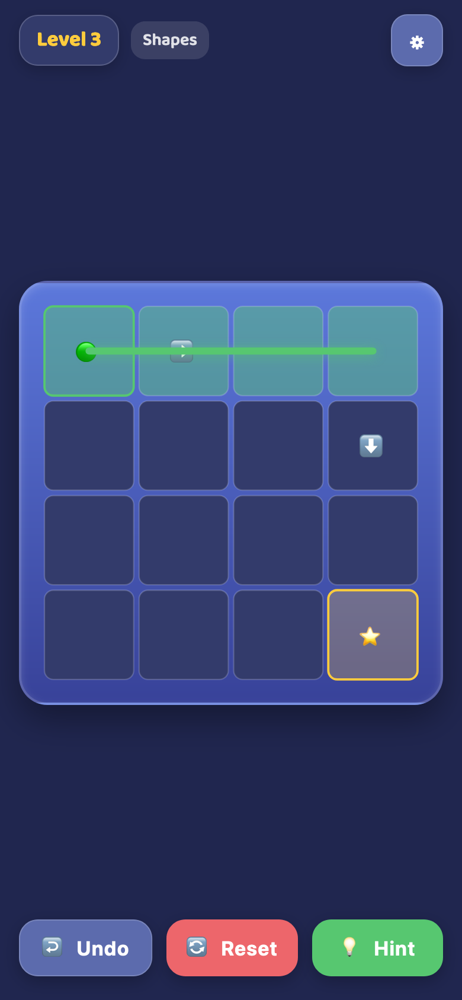
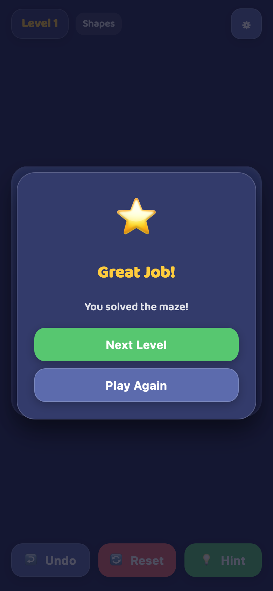

# Arrow Maze Kids 🏹🧭

A calm, kid-friendly puzzle game for [Playground](https://mpmisha.github.io/playground/).

Follow the arrows, trace a path from Start to Goal, and solve the maze!

## Screenshots

| Onboarding (Level 1) | Arrow Silhouette (Level 2) |
| :---: | :---: |
|  |  |

| Animal Silhouette (Level 12) | In-Progress Path | Level Complete |
| :---: | :---: | :---: |
|  |  |  |

## Features

- **Infinite Deterministic Levels:** 100% guaranteed solvable levels progressing from onboarding tutorial levels to easy, medium, and hard puzzles.
- **Original Shape Families:** Procedural board silhouettes including Arrow, Geometric shapes (Squares, L-Shapes, Frames, Diamonds), and friendly Animals (Cat, Fish, Turtle, Rocket).
- **Hybrid Input:** Touch/mouse drag tracing, tap stepping, and full keyboard Arrow/WASD controls.
- **Player Marker & Visual Guidance:** A glowing yellow circle marker (`.path-bead.head`) clearly indicates the player's active path endpoint, strictly constrained to valid, playable cells on the board (🟢 Start, ⭐ Goal).
- **Calm & Child-Friendly:** No timers, no lives, no score pressure, no ads, no tracking, and no scary failure.
- **Forgiving Controls:** Undo, Reset, and Next-step Hint.
- **English + Hebrew (RTL):** Fully localized interface supporting English and Hebrew (RTL) with Fredoka and Baloo 2 typography.
- **Offline PWA:** Installable standalone web app with complete offline caching via Service Worker.
- **Hub Return Handshake:** Integrates seamlessly with Playground hub via `?hub=` parameter and postMessage handshake.

## Local Preview

Run a simple HTTP server in the repository root:

```bash
python3 -m http.server 8000
```

Open `http://localhost:8000/` in your browser.

## Tech Stack

- Plain HTML5, CSS3, ES Modules
- SVG Board Vector Renderer
- Web Audio API Synthesizer & Vibration Haptics
- PWA Service Worker & Web App Manifest
